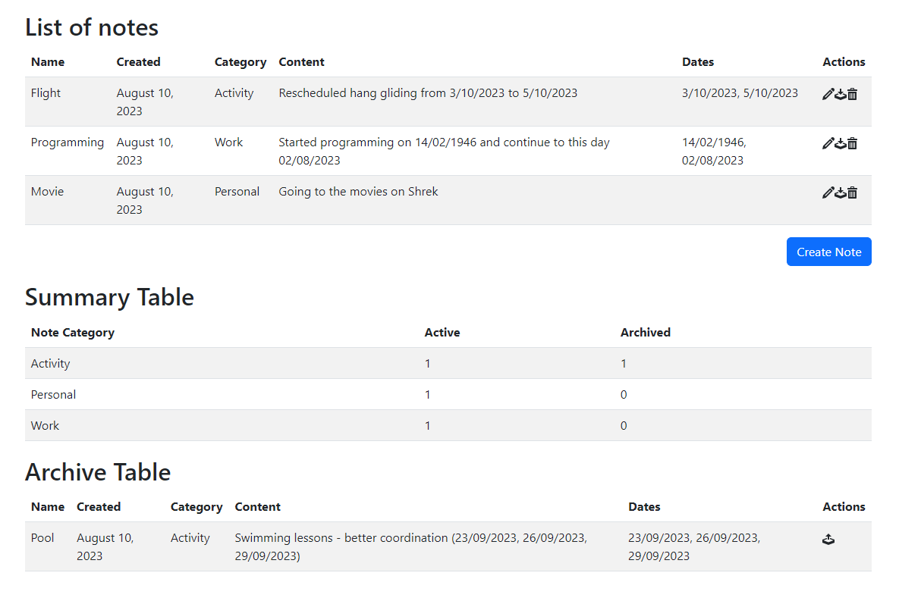

# React Note App

Welcome to  comprehensive note management application, crafted using the powerful trio of React, Redux, and TypeScript. The style is organized using the reactstrap library and the icons are react-icons.

An improved copy of the previous project https://github.com/vero-git-hub/notes-app, offering features that make it easier to work with notes.

;

## Key Highlights:

**Introducing the NoteList component:** a central hub showcasing a neatly organized table of all your notes. Each note comes with an array of intuitive buttons enabling effortless editing, deletion, and archiving.

**Behold the ArchiveList component:** purpose-built to elegantly display your archived notes. Effortlessly unarchive with a simple click.

**Revolutionary time management:** a feature that automatically timestamps your notes, while also skillfully extracting and interpreting dates from your content.

**Enter the world of creation and editing:**
* The CreateNoteModal component offers a  modal popup experience for crafting new notes with tailored options - from titles to categories and content.
* The EditNoteModal component seamlessly handles modifications to your existing notes.

**Statistics and analysis:** the SummaryTable component provides a quick overview of active and archived notes, intelligently categorized for your convenience.

**Zero tolerance for omissions:** We've implemented a robust validation system that ensures no note is left incomplete, with thorough checks for name and content fields.

## How to start
This project was bootstrapped with [Create React App](https://github.com/facebook/create-react-app). In the project directory, you can run:

### `npm start`

Runs the app in the development mode.\
Open [http://localhost:3000](http://localhost:3000) to view it in the browser.

The page will reload if you make edits.\
You will also see any lint errors in the console.

## Learn More

You can learn more in the [Create React App documentation](https://facebook.github.io/create-react-app/docs/getting-started).

To learn React, check out the [React documentation](https://reactjs.org/).